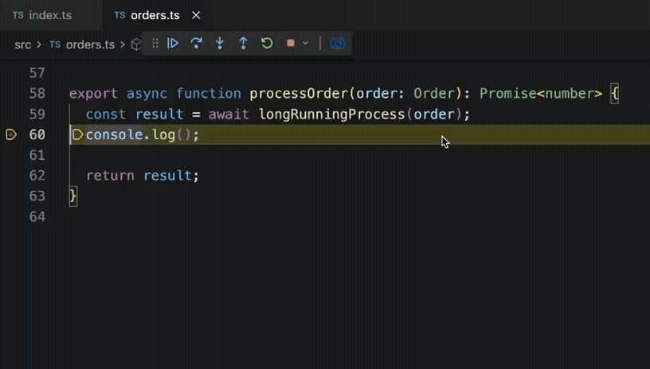

# Data Snapshot

Capture debug snapshots of variable values while paused in the debugger, and optionally stub them inline in source so you can run without re-executing slow operations.

## Features

### Capture variable snapshot

- **When:** While debugging, with the debugger paused (e.g. at a breakpoint).
- **How:** Select a variable or property access in the editor (e.g. `listings` or `order.items`), then:
  - Use the **Capture** button in the Debug toolbar, or
  - Right‑click → **Data Snapshot: Capture Selected Variable** (under the debug group).
- **What it does:**
  - Serializes the selected expression's value from the current stack frame.
  - Uses a **fast path** when possible: runs `JSON.stringify` inside the debuggee (Node.js) and reads the result in one round-trip. Handles circular refs, functions, and BigInt.
  - **Fallback:** Recursive DAP variable fetching with configurable max depth and concurrency limits.
  - Saves a snapshot under `.snapshots/snapshots/` with a name like `functionName_expression_timestamp.json`.
- **Limits:** Single variable or property access only; no raw object/array literals or multi-line expressions.

### Snapshots view

- **Location:** Activity bar → **Data Snapshot** → **Snapshots**.
- **List:** All `.json` snapshots in `.snapshots/snapshots/`, newest first.
- **Open:** Click a snapshot to open its JSON file in the editor.
- **Delete:** Right‑click a snapshot → **Data Snapshot: Delete Snapshot**.
- **Delete All:** Use the view title context menu → **Data Snapshot: Delete All Snapshots**.

### Inline stubs (run without re-executing)

- **Apply stub:** After a capture, the extension replaces the declaration line for the captured variable in its source file with code that reads the snapshot and assigns the captured value. When you run (without debugging), that variable gets the captured data instead of executing the slow call.
- **Scope:** Rewrites the variable's declaration in the file where it was captured, so all callers — in the same file or elsewhere — automatically use the stubbed value.
- **Multiple declarations:** If the same variable is declared in several places, a quick pick lets you choose which line to stub.
- **Revert:** Use **Data Snapshot: Remove All Stubs** to find all stub blocks (marked with `// data-snapshot-stub-start` / `// data-snapshot-stub-end`) under `src` and restore the original lines.

### Configuration

| Setting                  | Type   | Default | Description                                                               |
| ------------------------ | ------ | ------- | ------------------------------------------------------------------------- |
| `data-snapshot.maxDepth` | number | `5`     | Maximum recursion depth when serializing nested variables (DAP fallback). |

## Commands

| Command                                  | Description                                            |
| ---------------------------------------- | ------------------------------------------------------ |
| Data Snapshot: Capture Selected Variable | Capture the selected expression (debug only).          |
| Data Snapshot: Delete Snapshot           | Delete the snapshot (from view context menu).          |
| Data Snapshot: Delete All Snapshots      | Delete every snapshot (from view title menu).          |
| Data Snapshot: Remove All Stubs          | Revert all inline stubs in `src/**/*.{ts,tsx,js,jsx}`. |

## Activation

The extension activates when you start a debug session (`onDebug`). Commands that capture or list snapshots are available when the debugger is active and paused as needed.
